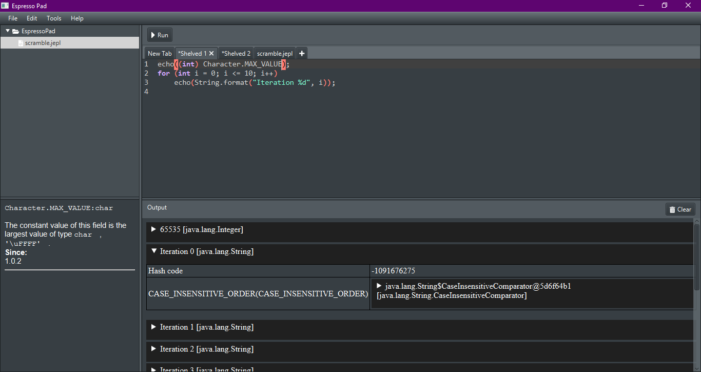

# Espresso Pad

Espresso Pad is a simple editor to run snippets of Java code. It does not require classes, or methods but they are supported. It utilizes the JShell APIs under the hood.

## Features
- Syntax highlighting
- Basic code completion
- Can run from entire classes to methods or statements
- System aware theming
- Documentation preview
- Code formatting thanks to [jastyle](https://github.com/AbrarSyed/jastyle)
- Dependency management thanks to [maven-archeologist](https://github.com/square/maven-archeologist)
- Default imports management. Sample default imports include `java.util.stream.*`, `java.util.*`, `java.io.*`
- `echo()` method to dump objects to output
- Basic file management e.g. rename, delete, show in folder, refreshing.
- Supports user input
- Brace and quote matching with completion
- Find/replace
- Shelving of unsaved files for the purpose of working on them later

Version 0.16.2 showing the `echo()` method dumping a `java.lang.String` object.

# Contributing
We welcome contributions from the community.
Before submitting a pull request, please make sure to run the tests and ensure that your changes do not introduce any regressions.

# License
Espresso Pad is released under the MIT License. See the [LICENSE](https://www.mit.edu/~amini/LICENSE.md) file for details.